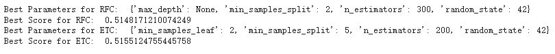
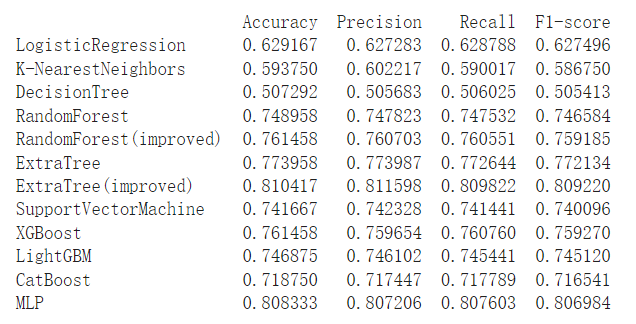
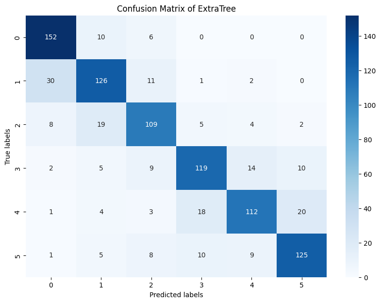

# ML_French_Blancpain
Group Members: Yue Wu, Zayna Chanel

## Video
 **[Check our video here](https://youtu.be/ZaAc7edc38Q)**

## Repository Index
- [French_difficulty_original.ipynb](/French_difficulty_original.ipynb): The python notebook for the model training with original data
- [improved_model.ipynb](/improved_model.ipynb): The python notebook for the improved model training 
- [Image](/Image): The folder of essential images in the notebook
- [streamlit](/streamlit): The folder of essential images in the notebook
- [data_augmentation.ipynb](/data_augmentation.ipynb): The code for data augmentation
- [back_translation.csv](/back_translation.csv): The augmented data using back translation (generated by [data_augmentation.ipynb](/data_augmentation.ipynb))
- [nlpaug.csv](/nlpaug.csv): The augmented data using nlp (generated by [data_augmentation.ipynb](/data_augmentation.ipynb))
- [unlabelled_test_data.csv](/unlabelled_test_data.csv): The unlablled data for prediction (provided by Kaggle)
- [training_data.csv](/training_data.csv): The original data for training (provided by Kaggle)
- [sample_submission.csv](/sample_submission.csv): The sample submission (provided by Kaggle)
- [README.md](/README.md): The README document

# 1.Model preparation
## 1.1 Dataset split
An essential step in preparing our dataset for model training and evaluation is to divide it into training and validation sets.

**Implementation Details:**
To split our dataset, we use the train_test_split function from the sklearn.model_selection module. We specify a test_size of 0.1, which allocates 10% of the dataset to the validation set and the remaining 90% to the training set.
**Output Variables**:
_train_texts_: Text data for training the model.
_val_texts_: Text data reserved for validating the model's performance.
_train_labels_: Difficulty labels corresponding to the training text data.
_val_labels_: Difficulty labels corresponding to the validation text data.
This split ensures that we have a robust dataset for training while also setting aside a representative portion of data for performance evaluation, crucial for fine-tuning our model parameters.

## 1.2 Data preparation
We choose to use the Bidirectional Encoder Representations from Transformers (Bert), a state-of-the-art pre-trained language model based on the Transformer architecture. Bert is highly regarded for its deep understanding of language context and its ability to perform various natural language processing (NLP) tasks. It learns language representations on a large-scale text corpus. Its strengths include powerful pre-trained language capabilities, bi-directional encoding, and transfer learning potential, which make it ideal for extracting textual features.
We implemented the text feature extraction process through a function named 'bert_feature(data, **kwargs)'. This function is designed to process a list of text data, performing tokenization and encoding to transform texts into a format suitable for further treatment. 
Before training our models, it's crucial to scale the feature data.We utilize the StandardScaler from sklearn.preprocessing to scale our feature vectors. 
For our classification task, it is necessary to convert categorical labels into a numerical format that our models can work with. We define a mapping from the categorical difficulty levels (A1, A2, B1, B2, C1, C2) to integers (0, 1, 2, 3, 4, 5). This is done to facilitate the model's ability to perform mathematical operations on the output predictions.

## 1.2 Classification and model evaluation 
After preparing our data, we proceed to evaluate various classification models to determine their effectiveness in predicting sentence difficulty. Below is a summary of the performance metrics for each model we tested.

**Evaluation Metrics:**
_Accuracy_: Proportion of total predictions that were correct.
_Precision_: Proportion of positive identifications that were actually correct.
_Recall_: Proportion of actual positives that were identified correctly.
_F1-Score_: Harmonic mean of precision and recall, providing a single metric that balances both.

**Model Performance Summary:**
We tested a variety of machine learning models to find the best performer for our  task. The models evaluated include **Logistic Regression, K-Nearest Neighbors, Decision Tree, Random Forest, Extra Trees, Support Vector Machine,** and several **boosting algorithms (XGBoost, LightGBM, CatBoost)**, as well as a **Multi-Layer Perceptron (MLP)**. 

To enhance the performance of our RandomForest and ExtraTrees classifiers, we employed GridSearchCV from sklearn.model_selection as hyper-parameter optimization to find the best solution. This tool allows us to systematically explore multiple combinations of parameter tunes, and determine which parameters yield the best model performance.

In our evaluation of various machine learning models, the Support Vector Machine (SVM) exhibited the highest overall accuracy and F1-score, highlighting its superior performance for our text difficulty prediction task. This model effectively managed to balance precision and recall, making it highly suitable for our application.

Support Vector Machine (SVM): SVM achieved the highest F1-score among all the models tested, demonstrating its efficacy in handling the complex patterns in our feature data derived from the CamemBERT model. Its robust performance in both precision and recall makes it particularly valuable for predicting sentence difficulty where maintaining a balance between false positives and false negatives is crucial.

Random Forest (improved): This model showed a marked improvement over the basic Random Forest, indicating that enhancements such as parameter tuning can significantly boost performance.

The confusion matrix provides a visual representation of the performance of the Support Vector Machine (SVM) model, particularly how well the model classifies sentences across different difficulty levels.

The x-axis represents the predicted labels by the model.
The y-axis represents the true labels, i.e., the actual difficulty levels.
Each cell in the matrix shows the count of predictions made by the model, where the predicted difficulty level corresponds to the column, and the true difficulty level corresponds to the row.
Diagonal Cells (True Positives): The cells on the diagonal from the top-left to the bottom-right represent correct predictions where the predicted labels match the true labels. High numbers in these cells indicate better performance for specific difficulty levels.
Off-Diagonal Cells (Misclassifications): Cells above the diagonal show where the model has predicted a difficulty level that is higher than the true level. Cells below the diagonal show where the model has predicted a difficulty level that is lower than the true level.
This matrix indicates that while the SVM performs well in classifying sentences into correct difficulty levels, especially for mid and higher levels (B1, B2, C1, C2), there are areas of improvement needed for distinguishing between the closest difficulty levels, particularly among the lower levels (A1, A2).

To further understand the performance of each classification model, we analyze specific instances where models failed to predict the correct labels. This insight allows us to identify common patterns of errors and may inform future improvements in model training or feature engineering.

We notice that certain indices are consistently misclassified across multiple models, which typically suggests challenges such as inherent complexity or ambiguity in the sentences, insufficient feature representation, or fundamental limitations of the models themselves.

## 1.3 Data Augmentation
To enhance the diversity and volume of our training data, we employed two primary data augmentation techniques: back translation and NLP-based augmentation. These methods help improve the models' ability to generalize across various sentence structures and expressions.

**Back Translation**
Back translation involves translating a sentence from the original language (in this case, French) to a second language (in our case, English) and then translating it back to the original language. This process often introduces subtle variations in phrasing and word choice, effectively creating new sentence variants while maintaining the original meaning. This technique is particularly useful for: 
Enriching the dataset with varied syntactic structures.
Enhancing model robustness against slight linguistic variations.

**NLP-Based Augmentation**
NLP-based augmentation leverages natural language processing techniques to modify sentences in ways that preserve their original semantic content. Methods include:

Synonym Replacement: Substituting words with their synonyms while keeping the sentence's context intact.
Random Insertion: Adding words at random positions within the sentence to increase sentence complexity and variability.
Random Deletion: Removing random words from the sentence, forcing the model to focus on less obvious features of the text.
Sentence Shuffling: Rearranging the order of words or phrases in the sentence without altering the overall meaning.

Together with back translation method, we have the following results:

After introducing back translation as a data augmentation technique, we observed significant improvements in model performance. MLP (Multi-Layer Perceptron) demonstrated the most substantial improvement, with its accuracy reaching 0.808333 and F1-score at 0.806984, marking it as the top performer. These enhancements suggest that the augmented dataset, enriched with varied linguistic expressions via back translation, provides a more robust training foundation, improving generalization capabilities of the models.
While the back translation augmentation led to improvements in model accuracy, the confusion matrix for the ExtraTree classifier revealed that some misclassifications between non-adjacent levels still persist. 

Then we use the whole dataset to retrain the model and use the retrained model to predict the difficulty level in the unlabelled test dataset. And save the trained model and scaler for UI.

In our latest model development, we employed an ensemble approach using both the BERT (BertForSequenceClassification) and CamemBERT (CamembertForSequenceClassification) models, leveraging their strengths to enhance the accuracy of predicting sentence difficulty in multiple languages.
BERT is a multilingual model capable of understanding multiple languages, which is particularly useful for datasets involving diverse linguistic content.
CamemBERT is a model trained specifically on French language text, optimized for understanding nuances in French.
After training, we predicted the difficulty levels using both models on their respective test datasets.
We ensemble the predictions by averaging both models. This approach leverages the predictive power of both models, smoothing out any overconfidence in single model predictions. As a result, we improved the final test prediction accuracy above 0.6!

Yue Wu: coding, submission, confusion matrix, classifer comparison, hyper-parameter, error analysis, streamlit UI, github and README, and the video manuscript content

Zayna Chanel: coding, submission, confusion matrix, model comparison the video manuscript content and video editting
